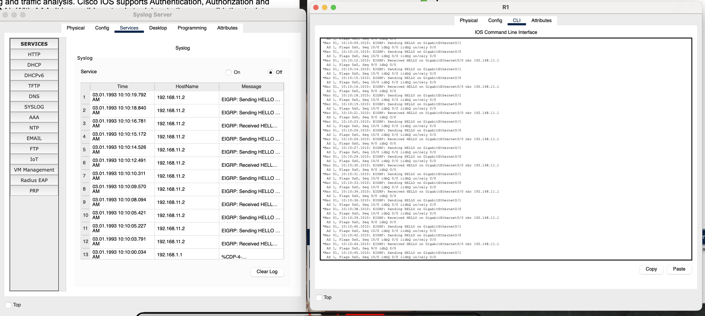
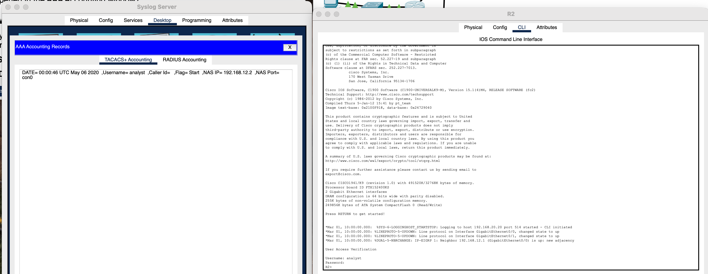
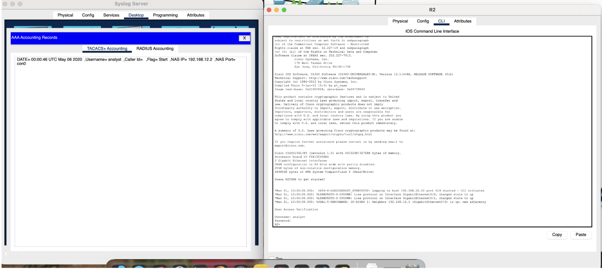
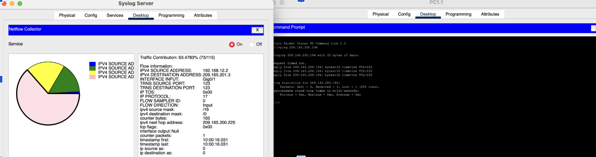

# Lab 02 – Syslog, AAA, and NetFlow Monitoring

## Overview

This lab uses Cisco Packet Tracer to observe three distinct network monitoring
technologies operating simultaneously: Syslog for device event logging, AAA
(Authentication, Authorization, and Accounting) for user access tracking, and
NetFlow for traffic flow analysis. The lab culminates in a reflection on how
SIEM systems unify these separate data sources.

**Tool:** Cisco Packet Tracer  
**Topic:** Network Security Monitoring  
**Cyber Essentials Controls:**
- **User Access Control** — AAA logging demonstrates how user authentication
  events are recorded and auditable
- **Security Monitoring** — Syslog and NetFlow show how device events and
  traffic flows are captured for analysis

---

## Network Topology

```
[PC1–PC4]──[Core Switch]──[R1]──[R2]──[Firewall]──[Internet]
                │                                       │
          [Syslog Server]                     [Corp Web Server]
          [AAA/TACACS+ Server]                 209.165.200.194
          [NetFlow Collector]
```

| Device         | Role                                              |
|----------------|---------------------------------------------------|
| R1             | EIGRP router / Syslog client                      |
| R2             | TACACS+ AAA client / Syslog client                |
| Core Switch    | Syslog client                                     |
| Firewall       | Syslog client / NetFlow exporter                  |
| Syslog Server  | Syslog collector, AAA/TACACS+ server, NetFlow collector |

---

## Part 1 – Syslog Event Logging

### What I did
Enabled EIGRP debug logging on R1 with `debug eigrp packets`, then observed
the resulting entries in the Syslog server.

### What appeared in the Syslog server



Each log entry contained the following fields:

| Field      | Example Value         | Meaning                              |
|------------|-----------------------|--------------------------------------|
| Entry #    | 1, 2, 3...            | Sequential record number             |
| Time       | 03:01.1900 10:10:19   | Timestamp of the event               |
| HostName   | 192.168.11.2          | IP address of the Syslog client (R1) |
| Message    | EIGRP: Sending HELLO / Received HELL... | The debug event description |

**Severity level in this lab:** Packet Tracer only supports Level 7 (Debugging).
On real equipment, severity levels 0–6 would also be captured, with lower
numbers representing more critical events (0 = Emergencies, 6 = Informational).

### Key observations

- Every EIGRP HELLO packet sent and received by R1 generated a separate log
  entry. In a production network this would produce high log volume quickly,
  which is why debug logging is only enabled temporarily for troubleshooting.
- The hostname field shows the source IP, not the device name. In a real
  environment, configuring devices with hostnames mapped to IPs in the Syslog
  server makes logs significantly easier to read.
- A CDP entry (`%CDP-4-...`) also appeared, showing that Syslog captures all
  protocol activity at the configured severity level, not just the protocol
  you're focused on.

---

## Part 2 – AAA User Access Logging (TACACS+)

### What I did
Logged into R2 via CLI using credentials `analyst / cyberops`. R2 is
configured to authenticate against a TACACS+ server. After observing the
login record, I issued `logout` and observed the change.

### AAA record on login



```
DATE= 00:00:46 UTC May 04 2020
Username= analyst
Caller-Id=
Flags= Start
NAS IP= 192.168.12.2
NAS Port= con0
```

### AAA record after logout



```
DATE= 00:00:46 UTC May 04 2020  [login record — unchanged]
DATE= 00:02:39 UTC May 04 2020  [logout record added]
Username= analyst
Caller-Id=
Flags= Stop
NAS IP= 192.168.12.2
NAS Port= con0
```

### Key observations

**What the Flags field tells you**

The `Start` flag marks the beginning of a session; the `Stop` flag marks its
end. This pairing is how AAA accounting calculates session duration and
confirms clean logouts vs dropped sessions. A `Start` with no corresponding
`Stop` is a red flag — it may indicate a session that was never properly
terminated.

**What TACACS+ adds vs local authentication**

With local authentication, login attempts are only visible on the device
itself. TACACS+ centralises this — every login and logout across all AAA
clients (R2 in this case) is recorded in one place. This is essential for
incident response: you can answer "who logged into which device and when"
without accessing each device individually.

**NAS IP identifies the device**

`NAS IP= 192.168.12.2` is R2's IP address. In a network with many AAA
clients, this field tells you exactly which device was accessed.

---

## Part 3 – NetFlow Traffic Flows

### What I did
Pinged the Corp Web Server at 209.165.200.194 from a PC and observed the
resulting flow record in the NetFlow Collector. The Firewall acts as the
NetFlow exporter in this topology.

### What appeared in the NetFlow Collector



| Field                  | Value              | Meaning                            |
|------------------------|--------------------|------------------------------------|
| Traffic Contribution   | 63.4785% (75/115)  | Dominant flow by packet count      |
| Source IP              | 192.168.12.9       | Originating PC                     |
| Destination IP         | 209.165.201.3      | Corp Web Server (via NAT)          |
| Source Port            | 0                  | ICMP — no transport port           |
| Destination Port       | 123                | Unexpected — see note below        |
| IP Protocol            | 0                  | Recorded as 0 in PT simulation     |
| Interface Input        | (captured on firewall interface) |                      |
| Next-hop               | 209.165.200.225    | Next routing hop toward internet   |

> **Note on destination port 123:** Port 123 is NTP (Network Time Protocol).
> This flow may represent background NTP traffic captured alongside the ICMP
> ping, or a Packet Tracer simulation artefact. This is consistent with the
> lab's warning that EIGRP and other background protocol traffic is also
> captured by the NetFlow exporter.

**Other flows visible in the pie chart**

The collector showed multiple flow segments before the ping was issued,
confirming that EIGRP routing protocol traffic between devices was already
being captured. This is an important real-world consideration — NetFlow
captures *all* flows through the exporter, not just the traffic you're
interested in. Filtering and analysis tools are needed to isolate relevant
flows.

---

## Reflection – Why SIEM Matters

This lab ran Syslog, AAA, and NetFlow as separate services. In practice this
creates three problems:

- **Correlation is manual.** If a suspicious login (AAA) coincides with
  unusual traffic (NetFlow) and a device error (Syslog), connecting those
  three events requires checking three separate systems.
- **Timestamps may differ.** Each system uses its own clock. Without NTP
  synchronisation, log correlation becomes unreliable.
- **Volume is unmanageable at scale.** Debug-level Syslog alone from a single
  router generated 13 entries in seconds. A real network produces millions of
  events daily.

**SIEM (Security Information and Event Management)** solves this by ingesting
all three data sources into a single platform, normalising timestamps,
correlating events across sources, and enabling alerting on patterns rather
than individual events. Examples include Splunk, IBM QRadar, and Microsoft
Sentinel.

---

## What I Learned

1. **Syslog severity levels are a triage tool.** In production, you configure
   devices to only forward events above a certain severity, preventing log
   floods while ensuring critical events are captured.

2. **AAA Start/Stop pairs are the foundation of access auditing.** A Start
   without a Stop is an anomaly worth investigating. This is how security
   teams detect persistent unauthorised sessions.

3. **TACACS+ centralises authentication evidence.** Local auth leaves no
   centralised trail. TACACS+ means every access event across the network is
   in one place — critical for forensic investigation.

4. **NetFlow captures more than you intend.** Background routing protocols
   (EIGRP, NTP) appear alongside user traffic. In a monitoring role, you need
   to baseline normal background flows so anomalies stand out.

5. **These three tools answer different questions:**
   - Syslog: *What happened on this device?*
   - AAA: *Who accessed this device and when?*
   - NetFlow: *What traffic crossed this network boundary?*
   SIEM is the layer that lets you ask all three questions together.

## What I Would Do Differently

- Configure R1 and R2 with NTP so Syslog timestamps are reliable and
  correlatable across devices.
- Test a failed login attempt on R2 and observe how AAA records the denial —
  this is more security-relevant than a successful login.
- Filter the NetFlow collector to isolate only ICMP flows and compare the
  result to the unfiltered view, demonstrating why flow filtering matters.

---

## Files

| File | Description |
|------|-------------|
| `topology/syslog-aaa-netflow-lab.pkt` | Packet Tracer source file |
| `topology/topology.png` | Network diagram |
| `screenshots/part1-syslog-eigrp.png` | Syslog entries from R1 debug |
| `screenshots/part2-aaa-login.png` | AAA record on analyst login |
| `screenshots/part2-aaa-logout.png` | AAA record after logout |
| `screenshots/part3-netflow-ping.png` | NetFlow collector after ping |
