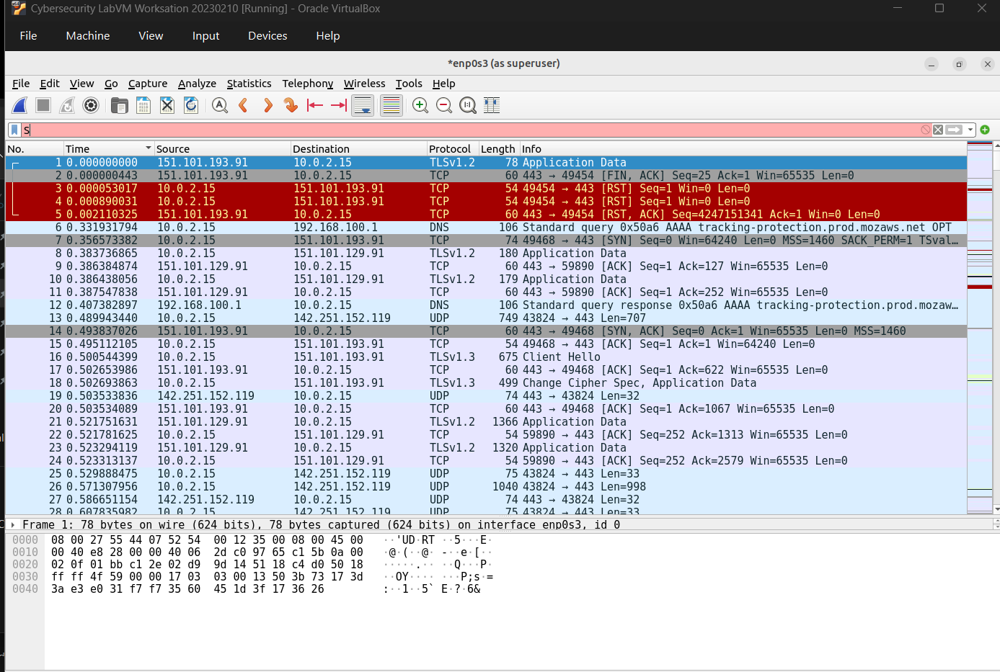
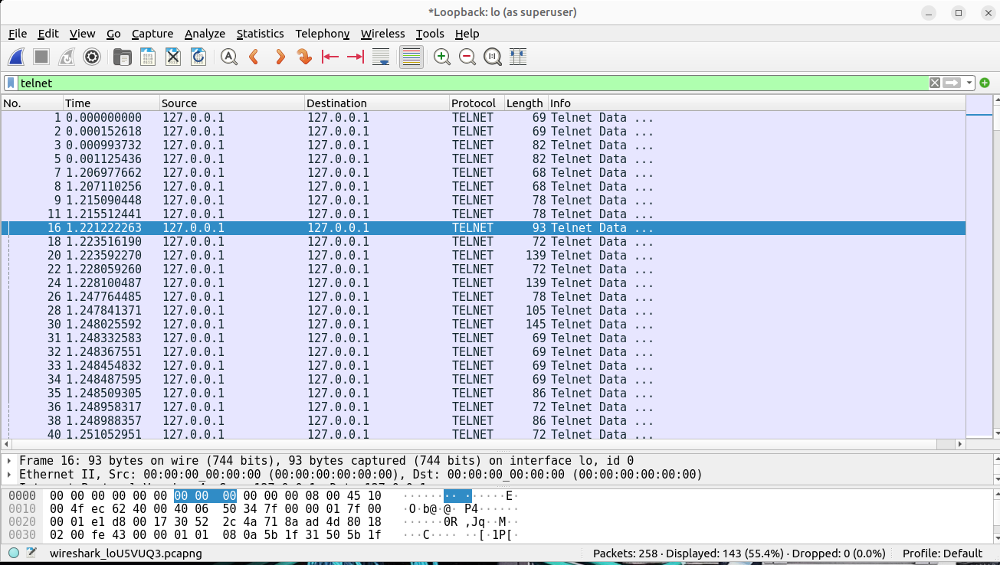
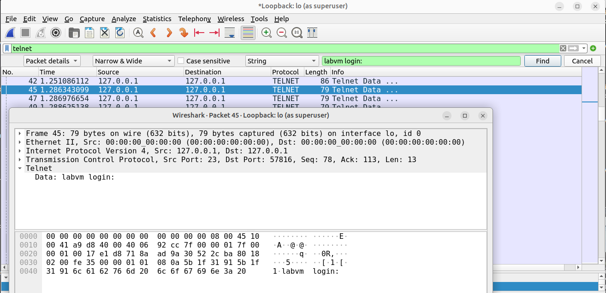
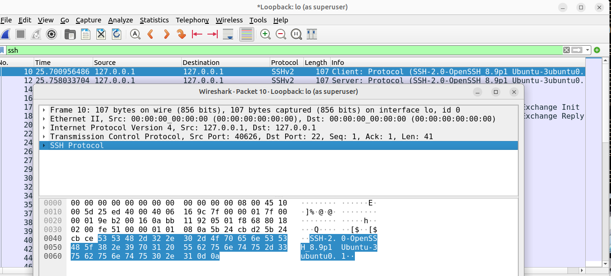

# Lab 03 – Wireshark: Comparing Plaintext and Encrypted Traffic

## Overview

This lab uses Wireshark to capture and analyse three types of traffic on a
single VM: HTTPS web browsing, Telnet, and SSH. The objective is to directly
observe the difference between plaintext and encrypted protocols at the
packet level — including watching login data appear in cleartext during a
Telnet session, and confirming what SSH does and does not expose.

**Tool:** Wireshark (Cybersecurity LabVM, Oracle VirtualBox)  
**Topic:** Packet Analysis, Protocol Security  
**Cyber Essentials Control:** **Secure Configuration** — this lab is a
first-hand demonstration of why insecure protocols like Telnet should be
disabled in favour of SSH.

---

## Part 1 – Baseline Capture (Web Traffic to cisco.com)

### What I did
Captured traffic on `enp0s3` while Firefox loaded www.cisco.com.

### Findings



The capture shows a mix of:

- **DNS** queries and responses resolving cisco.com and related domains
- **TLSv1.2 / TLSv1.3** application data — the actual page content
- Standard **TCP** handshake and teardown packets (SYN/ACK, FIN, RST)

No HTTP or readable page content appears anywhere in the capture. Every
request and response after the TLS handshake is labelled "Application Data"
with no visible plaintext. This confirms that modern web traffic to a major
site is encrypted by default — and sets up the contrast with Telnet below.

---

## Part 2 – Telnet (Plaintext Protocol)

### What I did
Started a capture on **Loopback: lo**, ran `telnet localhost`, logged in as
`cisco` with password `password`, and exited. Filtered on `telnet`, then used
**Find Packet** (Display filter: String, Packet list: Packet details) to
search for `labvm login`.

### Troubleshooting note

My first capture attempt used the Ethernet interface and showed no Telnet
packets. `telnet localhost` connects via `127.0.0.1`, which only appears on
the **loopback interface**. Switching the capture to **Loopback: lo** resolved
this immediately.

> **Why this matters:** This wasn't a Wireshark fault — it was a scope
> problem. A capture tool only sees what it's pointed at. "No traffic
> captured" is often a configuration issue, not an absence of traffic.

### Findings



The filtered capture on `lo` shows dozens of small TELNET packets, each
labelled "Telnet Data...", ranging from roughly 68–145 bytes. This
packet-per-keystroke pattern is itself a signature of Telnet — a normal SSH
or HTTPS session does not produce this many tiny, individually-timed packets
during login.

Searching for the string `labvm login` located **Frame 45**:



```
Frame 45: 79 bytes on wire, TCP Src Port 23, Dst Port 57816
Telnet
    Data: labvm login:
```

The literal text `labvm login:` is stored as the **Data** field of the
Telnet protocol layer, fully readable in both the Packet Details pane and the
ASCII column of the Packet Bytes pane.

Continuing through the subsequent packets one at a time (as described in the
lab procedure) reveals the username `cisco` and password `password`, each
character sent as the Data field of an individual packet — doubled on
loopback because both the outbound keystroke and its echo back are captured.

### Security implication

Anyone who can read traffic on this segment — no decryption, no special
tooling — can reconstruct the entire login sequence: prompt, username, and
password, character by character. This is the concrete, observable reason
Telnet is considered unsuitable for any authenticated session.

---

## Part 3 – SSH

### What I did
Started a new capture on **Loopback: lo**, ran `ssh localhost`, accepted the
ED25519 host key fingerprint, authenticated with the same credentials
(`cisco` / `password`), and exited. Filtered on `ssh`.

### Findings



```
Frame 10: Client → Server: Protocol (SSH-2.0-OpenSSH_8.9p1 Ubuntu-3ubuntu0.1)
Frame 12: Server → Client: Protocol (SSH-2.0-OpenSSH_8.9p1 Ubuntu-3ubuntu0.1)
```

### An important nuance: SSH is not 100% opaque

The very first two packets of an SSH session — the **protocol version
exchange** — are sent in **plaintext by design**, per the SSH protocol
specification (RFC 4253). In this capture, both the client's and server's
SSH/OpenSSH version strings are fully readable in the hex dump.

This is a meaningful distinction from "SSH is fully encrypted, full stop":

| Exposed in plaintext | Never exposed |
|------------------------|----------------|
| SSH software name and version (`OpenSSH_8.9p1`) | Username |
| | Password |
| | Any command or output |
| | Host key fingerprint content (only its hash is shown locally to the user) |

**Why this matters in practice:** the version banner is metadata used for
compatibility negotiation. It tells an observer (or attacker) *what software*
is running — which is useful for targeting known vulnerabilities in specific
OpenSSH versions — but it reveals nothing about *who* is logging in or *what
they're doing*. This is the same category of leakage as a web server
revealing its software version in HTTP headers: not a credential leak, but a
reconnaissance data point.

Everything after the version exchange — key exchange, authentication, and the
session itself — is encrypted, which is consistent with the terminal session
completing normally with no further readable application data in the capture.

---

## Direct Comparison

| | Telnet | SSH |
|---|--------|-----|
| Software/version banner | N/A (no banner) | Readable plaintext |
| Login prompt | **Readable plaintext** | Encrypted |
| Username | **Readable, char-by-char** | Encrypted |
| Password | **Readable, char-by-char** | Encrypted |
| Command output | Readable plaintext | Encrypted |
| Wireshark filter | `telnet` | `ssh` |
| Port | TCP 23 | TCP 22 |
| Capture interface | Loopback: lo | Loopback: lo |

---

## What I Learned

1. **"Encrypted" is verifiable, not just a claim.** I directly observed a
   password reconstructed character-by-character from Telnet packets, and
   confirmed SSH does not expose the equivalent data — but I also confirmed
   SSH isn't *zero*-disclosure, which is a more accurate understanding than
   "Telnet bad, SSH magic."

2. **Capture scope is part of the skill.** The loopback vs Ethernet interface
   issue wasn't a tooling failure — it was my assumption about where traffic
   would appear. Confirming *where* to look is as important as knowing what
   to look for.

3. **Metadata leakage is a real category, separate from credential
   leakage.** SSH version banners, TLS certificate details, and similar
   "harmless" plaintext fields are exactly the kind of information used in
   reconnaissance before an attack — even when the actual session content is
   secure.

4. **Telnet's packet pattern is a fingerprint on its own.** Even without
   reading packet contents, the volume and timing of small TELNET-labelled
   packets during a login is something a defender could alert on.

## What I Would Do Differently

- Run `nmap -sV localhost` against the SSH and Telnet ports and compare the
  service/version information Nmap reports to what Wireshark showed in the
  SSH banner — connecting reconnaissance tools to packet-level evidence.
- Use **Follow > TCP Stream** on the Telnet capture to view the entire session
  reconstructed as text in one pane, rather than reading packet-by-packet.
- Repeat Part 1 with an HTTP (not HTTPS) site to directly show a plaintext
  credential submission over the web, paralleling the Telnet finding.

---

## Files

| File | Description |
|------|-------------|
| `screenshots/01-cisco-capture.png` | TLS/DNS traffic to www.cisco.com |
| `screenshots/02-telnet-loopback-overview.png` | Filtered Telnet capture on Loopback: lo |
| `screenshots/03-telnet-login-packet-detail.png` | Frame 45 — readable `labvm login:` data |
| `screenshots/04-ssh-protocol-exchange.png` | SSH version banner exchange (plaintext) and terminal session |
