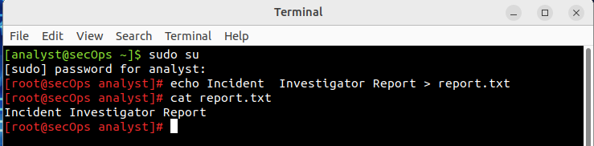
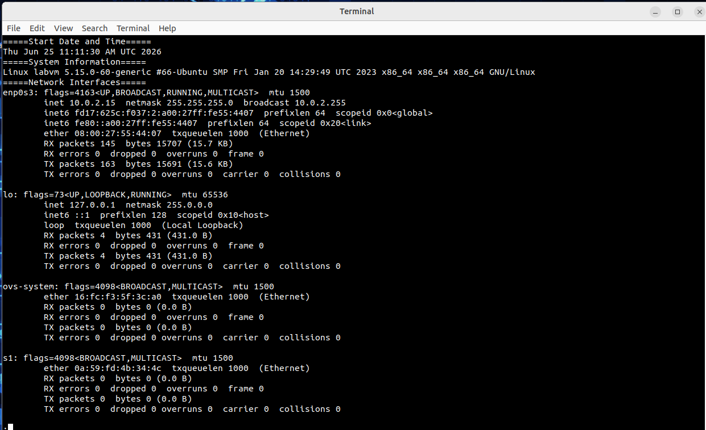
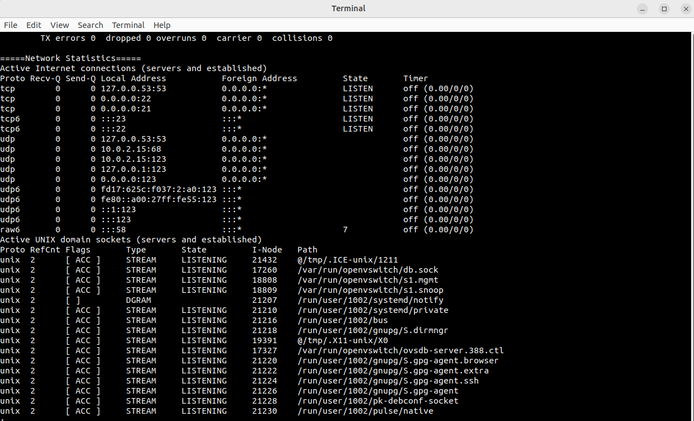
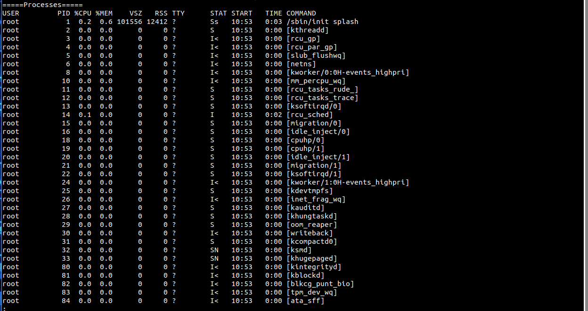
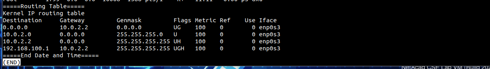
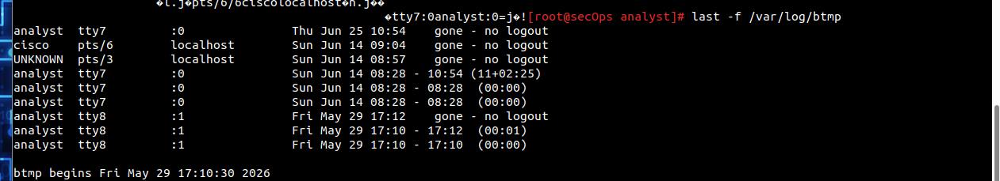
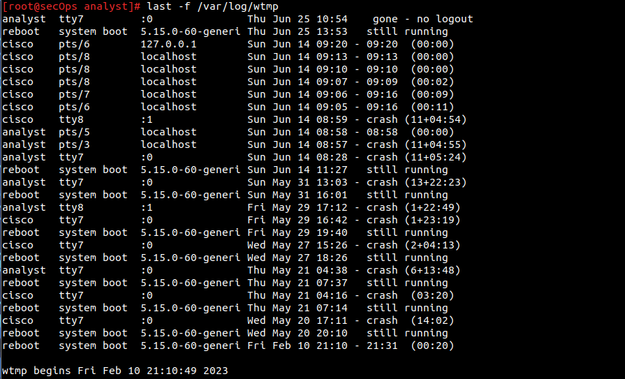

# Lab 06 – Gather System Information After an Incident

## Overview

This lab simulates the first-response actions taken when a Linux system is
suspected to have been compromised. The objective is to collect **volatile
data** — information held in RAM that is permanently lost when a system is
powered down — before the machine is shut down for forensic imaging.

The lab covers three evidence categories: volatile system state (RAM-based),
network posture (open ports and connections), and persistent logs
(auth, login history, and failed attempts).

**Tool:** CSE-LABVM (Ubuntu Linux, VirtualBox)  
**Topic:** Incident Response, Linux Forensics  
**Cyber Essentials Relevance:** This lab directly supports the **Logging and
Monitoring** principle underpinning Cyber Essentials Plus — knowing *what to
collect*, *in what order*, and *before shutdown* is foundational to any
incident response capability.

---

## Environment

| Detail | Value |
|--------|-------|
| Hostname | labvm / secOps |
| OS | Ubuntu Linux 5.15.0-60-generic (x86_64) |
| Capture timestamp | Thu Jun 25 11:11:30 AM UTC 2026 |
| Logged-in user | analyst |
| Escalated to | root (via `sudo su`) |

---

## Step 1 – Privilege Escalation

Before collecting system data, escalation to root is required. All collection
commands must run with root privileges to access full process, socket, and
log data.



```bash
sudo su
echo Incident Investigator Report > report.txt
```

The `report.txt` file is created with a header, then each subsequent section
is appended using `>>` to avoid overwriting previous data. This technique
ensures a single, time-bounded evidence file that can be transferred off the
system before shutdown.

---

## Step 2 – Volatile Data Collection

### 2a – System Information



```
Linux labvm 5.15.0-60-generic #66-Ubuntu SMP Fri Jan 20 14:29:49 UTC 2023
x86_64 GNU/Linux
```

Establishes the OS version and kernel for the record. In a real investigation
this confirms whether known kernel-level exploits are applicable.

### 2b – Network Interfaces

Four interfaces were present:

| Interface | IP | Status | Notes |
|-----------|----|--------|-------|
| enp0s3 | 10.0.2.15 | UP, active | Primary NIC — VirtualBox NAT |
| lo | 127.0.0.1 | UP | Loopback |
| ovs-system | — | DOWN | Open vSwitch — no traffic |
| s1 | — | DOWN | Open vSwitch bridge — no traffic |

The presence of `ovs-system` and `s1` (Open vSwitch interfaces) indicates
this VM is configured as a network emulation platform, consistent with the
CyberOps lab environment. Both are inactive.

### 2c – Network Statistics (Open Ports)



This is the most significant section of the report for triage purposes.

**Listening TCP/UDP ports identified:**

| Port | Protocol | Service | Risk |
|------|----------|---------|------|
| 21 | TCP | **FTP** | 🔴 High — plaintext file transfer |
| 22 | TCP | SSH | ✅ Expected — encrypted remote access |
| 23 | TCP6 | **Telnet** | 🔴 High — plaintext remote access |
| 53 | TCP/UDP | DNS (local) | ℹ️ systemd-resolved, internal only |
| 68 | UDP | DHCP client | ℹ️ Normal |
| 123 | UDP | NTP | ℹ️ Normal time synchronisation |

**Key findings:**

**Port 21 (FTP) — flagged.** FTP transmits all data including credentials
in plaintext. Its presence on a potentially compromised system means an
attacker could have used it to exfiltrate data or maintain access. The
`vsftpd` process (PID 851) running as **root** compounds this risk — a
successful FTP exploit would immediately yield root-level access.

**Port 23 (Telnet) — flagged.** As demonstrated in Lab 03, Telnet exposes
all session data including credentials in cleartext. Its presence here
alongside FTP suggests this VM is intentionally configured with insecure
services for lab purposes — but in a production environment, both would be
immediate remediation priorities under Cyber Essentials Secure Configuration
requirements.

**No unexpected established connections** were present at the time of
capture — all external-facing sockets were in LISTEN state with no active
foreign connections. This is consistent with an idle system, but does not
rule out prior connections that have since closed.

### 2d – Processes



Notable processes identified during triage:

| PID | User | Process | Notes |
|-----|------|---------|-------|
| 851 | root | `/usr/sbin/vsftpd` | FTP daemon — running as root |
| 863 | root | `/usr/sbin/sshd` | SSH daemon — expected |
| 906 | root | `/usr/sbin/xinetd` | Extended internet daemon — manages Telnet |
| 972 | root | `/usr/lib/xorg/Xorg` | Display server |
| 1777–1780 | root | `sudo su`, `bash` | This investigation session |
| 1799 | root | `ps axu` | Process snapshot command itself |

The `ps axu` process (PID 1799) appearing in its own output is expected and
confirms the snapshot captured a live system state. The `xinetd` process
(PID 906) is the service managing the Telnet listener on port 23.

### 2e – Routing Table



```
Destination     Gateway      Genmask              Flags  Iface
0.0.0.0         10.0.2.2     0.0.0.0              UG     enp0s3  (default route)
10.0.2.0        0.0.0.0      255.255.255.0        U      enp0s3  (local subnet)
10.0.2.2        0.0.0.0      255.255.255.255      UH     enp0s3  (gateway host)
192.168.100.1   10.0.2.2     255.255.255.255      UGH    enp0s3  (flagged)
```

The first three entries are standard VirtualBox NAT routing. The fourth
entry — a host route to `192.168.100.1` via the NAT gateway — is not a
default VirtualBox entry. In a real investigation, this would be flagged for
further investigation: it could indicate a persistent route added by an
attacker to redirect traffic, or it could be a lab configuration artefact.

---

## Step 3 – Log Analysis

### 3a – btmp (Failed Login Attempts)



```
analyst    tty7    :0          Thu Jun 25 10:54   gone - no logout
cisco      pts/6   localhost   Sun Jun 14 09:04   gone - no logout
UNKNOWN    pts/3   localhost   Sun Jun 14 08:57   gone - no logout
```

**UNKNOWN entry — flagged.** An `UNKNOWN` username in `btmp` means a login
attempt was made with a username that does not exist on the system. This is
distinct from a wrong password for a valid user. Combined with `gone - no
logout`, this indicates the session was dropped without clean termination.

This pattern is consistent with a brute-force or credential-stuffing attempt
where the attacker submitted an invalid username. In a production environment
this would trigger an alert and warrant investigation of the source IP.

The `btmp` log begins **Fri May 29 17:10:30 2026**, meaning failed login
records prior to that date were not retained. Log retention policy is a
relevant consideration here.

### 3b – wtmp (Login History)



Key observations from the login history:

- Multiple sessions for both `analyst` and `cisco` users from `localhost`
  (SSH loopback sessions — consistent with Lab 03 activity)
- Several sessions ending with **crash** rather than clean logout,
  indicating forced or abnormal termination rather than intentional exit
- The most recent reboot was **Thu Jun 25 13:53** (today), which is *after*
  the report was generated at **11:11** — confirming the report captured a
  pre-reboot state correctly

**Sessions ending in crash vs logout** — in a forensic context, a pattern
of crash terminations without corresponding logout records can indicate an
attacker forcibly killed sessions, a system instability caused by malicious
activity, or simply an unstable lab environment. Distinguishing between these
requires correlation with other log sources (syslog, auth.log).

---

## Findings Summary

| # | Finding | Severity | Evidence Source |
|---|---------|----------|----------------|
| 1 | FTP (port 21) listening, `vsftpd` running as root | 🔴 High | netstat, ps |
| 2 | Telnet (port 23) listening via `xinetd` | 🔴 High | netstat, ps |
| 3 | UNKNOWN login attempt on pts/3 (Sun Jun 14 08:57) | 🟡 Medium | btmp |
| 4 | Unexpected host route to 192.168.100.1 | 🟡 Medium | routing table |
| 5 | Multiple session crash terminations | 🟡 Medium | wtmp |
| 6 | No active established connections at time of capture | ℹ️ Info | netstat |

---

## Why Volatile Data Collection Order Matters

The commands were run in this deliberate sequence:

```
date → uname → ifconfig → netstat → ps → route → date
```

This order prioritises the most time-sensitive data first:

- **Network connections** (`netstat`) change second-by-second as sessions
  open and close. If an attacker's session was active, waiting would miss it.
- **Processes** (`ps`) can be killed or renamed. Capturing early reduces the
  window for anti-forensic interference.
- **Routing table** is more stable but still RAM-resident and lost on reboot.
- Bookending with `date` creates a verified time window for the entire
  report, which is critical for legal admissibility of evidence.

---

## What I Learned

1. **Volatile data is a race against shutdown.** Every piece of data in this
   report disappears the moment the system is powered off. The methodology —
   collect first, analyse later — is a fundamental incident response principle.

2. **Open ports are the attack surface made visible.** Finding ports 21 and
   23 open on a potentially compromised system immediately raises two
   questions: was this how they got in, and is this how they're maintaining
   access? `netstat` answers both in a single command.

3. **btmp UNKNOWN entries are more suspicious than wrong passwords.** A wrong
   password for a valid user could be a legitimate user who forgot their
   credentials. An UNKNOWN username suggests an automated attack trying
   usernames that don't exist — a classic brute-force signature.

4. **Processes confirm what ports suggest.** `netstat` showed port 23 open;
   `ps` identified `xinetd` as the responsible process. The two commands
   together give you the full picture — the what and the why.

5. **Routing table anomalies are easy to miss and hard to explain.**
   The `192.168.100.1` host route doesn't belong in a standard VirtualBox NAT
   environment. In a real investigation, unexplained routes are high-priority
   items — persistent routes are a known attacker technique for traffic
   redirection and lateral movement.

## What I Would Do Differently

- Add `last -f /var/log/auth.log` to the collection script to capture
  successful SSH authentications alongside failed ones.
- Hash the `report.txt` file immediately after creation with `sha256sum`
  to establish integrity — if the report is later used as evidence, you need
  to prove it hasn't been modified.
- Automate the collection sequence as a shell script so it runs consistently
  under time pressure without steps being skipped.
- Investigate the `192.168.100.1` route by checking `/etc/network/interfaces`
  and `ip rule list` for the source of the configuration.

---

## Files

| File | Description |
|------|-------------|
| `report/report.txt` | Full volatile data collection output |
| `screenshots/01-privilege-escalation.png` | `sudo su` to root |
| `screenshots/02-systeminfo.png` | System info and network interfaces |
| `screenshots/03-networkstats.png` | Open ports and connections |
| `screenshots/04-processes.png` | Running process list |
| `screenshots/05-routingtable.png` | Kernel routing table |
| `screenshots/06-btmp.png` | Failed login attempts |
| `screenshots/07-wtmp.png` | Login session history |
