# Lab 08 – Investigate a Threat Landscape

## Overview

This lab simulates three distinct attack scenarios within a single network
topology, demonstrating how different vulnerability types are exploited by
threat actors. The scenarios progress from network misconfiguration, through
social engineering leading to ransomware, to a sophisticated rogue access
point and DNS hijacking attack.

**Tool:** Cisco Packet Tracer  
**Topic:** Threat Landscape, Attack Vectors, Social Engineering  
**Programme:** Cisco CyberOps Associate / Networking Essentials

**Cyber Essentials Controls:**

| Control | Scenario |
|---------|----------|
| Secure Configuration | Part 1 — router misconfiguration exposes LAN to guests |
| Malware Protection | Part 2 — ransomware delivered via phishing email |
| User Access Control | Part 2 — default credentials used to access router |
| Firewalls | Part 3 — rogue AP bypasses network perimeter entirely |
| Security Monitoring | All parts — none of these attacks generated any alerts |

---

## Network Topology

```
[Greenville - Home Network]          [Branch Office]
  Smartphone 3 (Mary - external)       PC-BR1
  Home Office PC ──[Home Router]──     Laptop BR-1
  Webcam 192.168.100.101               Laptop BR-2
                                            │
[Cafe]                               [ISP / Mail Server]
  Cafe Customer Laptop                     │
  VPN Laptop                         [Data Center]
  Cafe Hacker Laptop ──[Rogue AP]     Corp Web / Malware Server
  Hacker Backpack                      10.6.0.250
    ├── Cafe_Hacker_Sniffer
    └── Wireless Router0 (Rogue AP)
         SSID: Cafe_WI-FI_FAST
```

---

## Part 1 – Network Configuration Vulnerability

### Scenario
Mary (Smartphone 3) is outside Bob's home and notices an open guest wireless
network. Using it, she attempts to reach devices on the internal home network
— which should be impossible on a correctly configured guest network.

### Findings

**Step 1 — External device reaches internal webcam**

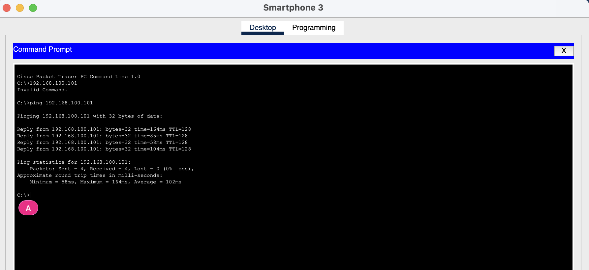

Smartphone 3, connected to the guest network from outside the home, pinged
the internal webcam at `192.168.100.101` successfully — 4 packets sent,
4 received, 0% packet loss.

This should not be possible. A guest network should be isolated from the
internal LAN. The successful ping proves the guest network has unrestricted
access to all internal devices.

**Step 2 — Identify the vulnerability in the router**

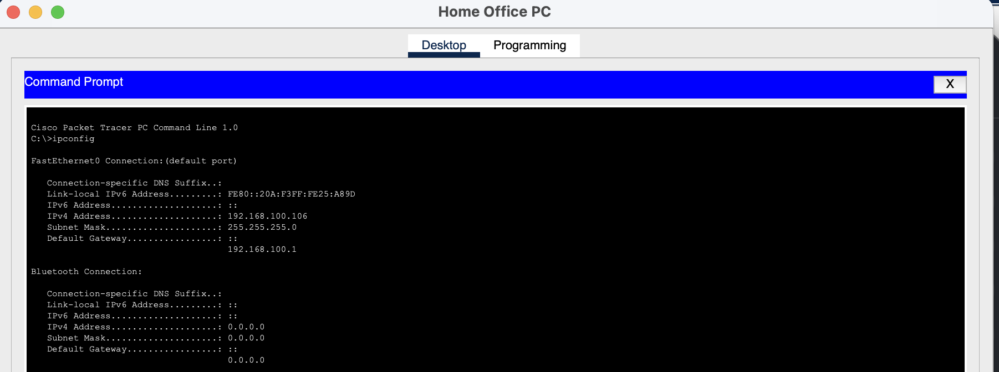

`ipconfig` on the Home Office PC confirmed the default gateway as
`192.168.100.1`. Accessing this via the web browser with default credentials
(`admin` / `admin`) — which had never been changed — revealed the router
configuration.

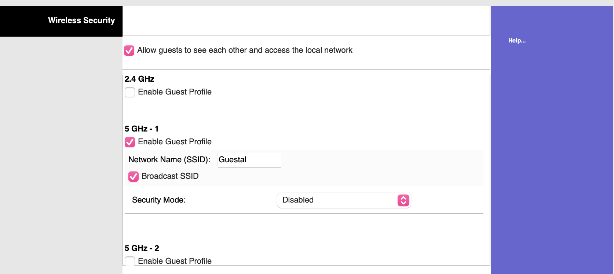

The Guest Network settings showed:

| Setting | Value | Problem |
|---------|-------|---------|
| Guest Profile Active | Yes (5 GHz-1, SSID: Guestal) | Guest network is broadcasting |
| Security Mode | **Disabled** | No authentication required to join |
| Broadcast SSID | Enabled | Network is visible to anyone nearby |
| Allow guests to access local network | **Checked** | Guests can reach all LAN devices |

**Two compounding vulnerabilities:**
1. The guest network has no security — anyone can join without a password
2. The guest isolation setting is disabled — guests can reach internal devices

Either alone is a misconfiguration. Together they allow anyone within
wireless range to reach every device on the home network, including the
webcam, without any credentials.

### Recommended remediation
- Disable the guest network entirely, or enable WPA2/WPA3 authentication
- Uncheck "Allow guests to access local network" to enforce isolation
- Change default router credentials immediately — `admin`/`admin` is the
  first combination any attacker tries
- Disable SSID broadcast if the guest network is not intended for public use

---

## Part 2 – Phishing → Ransomware

### Scenario
A threat actor at the Cafe composes a phishing email designed to trick Branch
Office employees into visiting a malicious URL. The email uses urgency and a
prize claim to bypass the victim's critical thinking.

### The phishing email

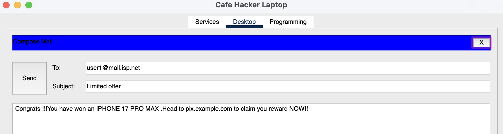

**Subject:** Limited offer  
**Body:** "Congrats !!! You have won an IPHONE 17 PRO MAX. Head to
pix.example.com to claim your reward NOW!!"

**Phishing indicators in this email:**
- Urgency language ("NOW!!")
- Unsolicited prize claim — a classic pretext
- Sender (`jim@mail.isp.net`) has no relationship to any prize authority
- The URL (`pix.example.com`) does not match any legitimate company domain
- Grammatical errors ("you reward")

### Delivery and receipt

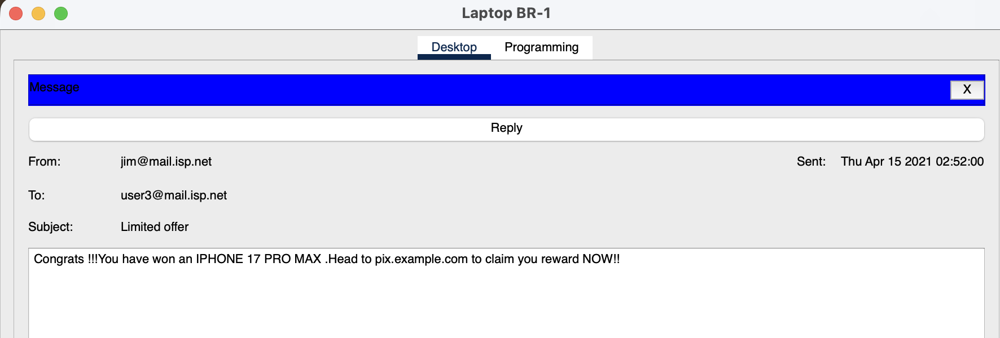

The email was received on Laptop BR-1 as `user3@mail.isp.net`. The content
is identical to what was sent — no mail filtering intercepted it.

### Payload — ransomware

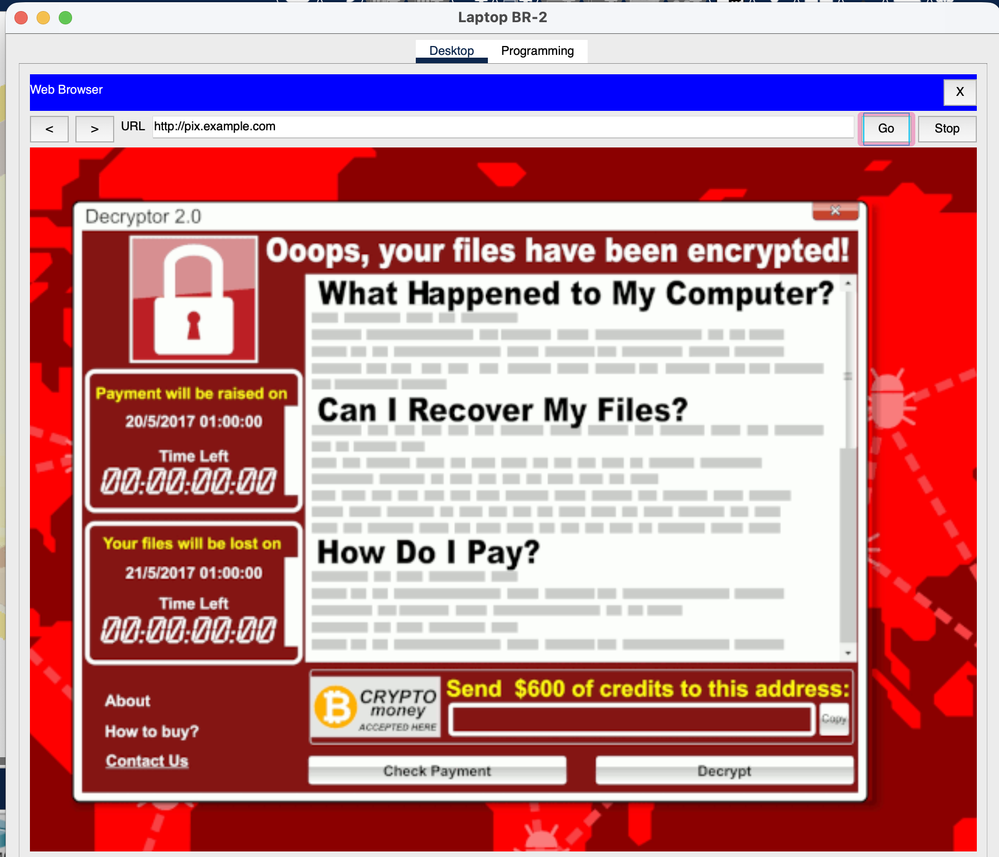

When the victim navigated to `http://pix.example.com`, the page loaded a
ransomware screen styled after the real-world **WannaCry** ransomware
(Decryptor 2.0):

- **Message:** "Ooops, your files have been encrypted!"
- **Demand:** $600 in cryptocurrency
- **Deadline:** Payment escalates after 20/5/2017 01:00:00
- **Threat:** Files permanently lost after 21/5/2017 01:00:00

This is a **ransomware attack delivered via phishing** — one of the most
common and damaging attack patterns in real-world incidents. The 2017 WannaCry
attack that this simulation references infected over 230,000 systems across
150 countries, causing an estimated $4–8 billion in damages.

### Why this worked
- No email filtering blocked the malicious message
- No web proxy or DNS filtering blocked `pix.example.com`
- The victim had no training to identify phishing indicators
- The URL was manually entered (Packet Tracer limitation — real attacks use
  clickable hyperlinks that are even harder to scrutinise)

---

## Part 3 – Rogue Access Point and DNS Hijacking

### Scenario
A threat actor at a cafe deploys a rogue wireless access point with a
convincing SSID, a DHCP server that distributes the attacker's IP as the DNS
resolver, and a DNS server that redirects legitimate domains to a malicious
server — a man-in-the-middle attack requiring no interaction beyond the
victim connecting to the wrong WiFi network.

### The attacker's equipment

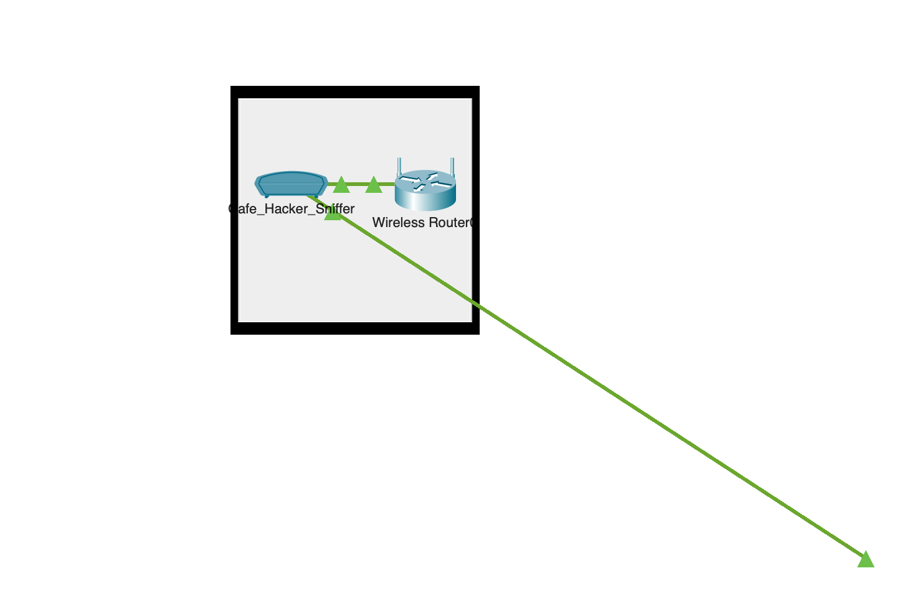

The hacker's backpack contained:
- **Cafe_Hacker_Sniffer** — network sniffer to capture victim traffic
- **Wireless Router0** — rogue access point broadcasting `Cafe_WI-FI_FAST`

The rogue network name is deliberately chosen to appear superior to the
legitimate `Cafe_WiFi` network — "FAST" implies better performance and the
lack of a padlock (no security) may not be noticed by a casual user.

### The attack chain

**Stage 1 — Victim connects to rogue AP**

The rogue AP broadcasts `Cafe_WI-FI_FAST` with no authentication, appearing
alongside the legitimate `Cafe_WiFi` (which has security enabled). A user
prioritising speed or convenience connects to the rogue network.

**Stage 2 — Malicious DHCP assigns attacker as DNS server**

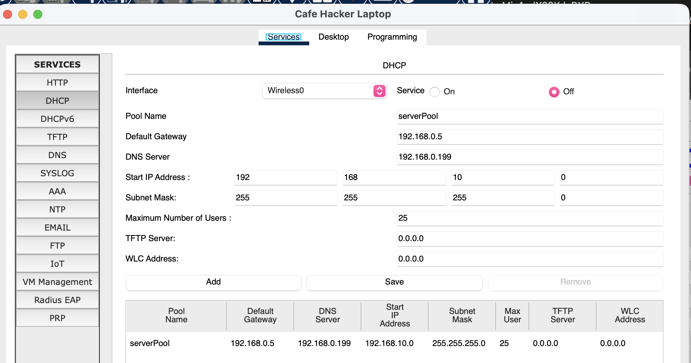

The hacker laptop's DHCP service distributes:

| Field | Value | Purpose |
|-------|-------|---------|
| DNS Server | `192.168.10.199` | Hacker laptop's own IP — malicious DNS |
| Default Gateway | `192.168.0.5` | Routes victim traffic through attacker |
| Pool | `192.168.10.0/24` | Assigns victim an IP in attacker's subnet |

**Stage 3 — DNS hijacking redirects legitimate domains**

The hacker laptop's DNS service maps `friends.example.com` to `10.6.0.250`
(the malware server) instead of the legitimate IP. When the victim's device
queries DNS for `friends.example.com`, it asks the hacker's DNS server, which
returns the malicious IP.

**Stage 4 — Victim IP configuration confirms the attack**

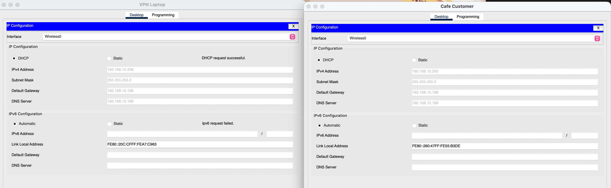

Side-by-side comparison of VPN Laptop vs Cafe Customer:

| Field | VPN Laptop | Cafe Customer |
|-------|-----------|---------------|
| IPv4 Address | 192.168.10.208 | 192.168.10.200/202 |
| Default Gateway | 192.168.10.198 | 192.168.10.198 |
| DNS Server | **192.168.10.199** | **192.168.10.199** |

Both devices received the hacker's IP (`192.168.10.199`) as their DNS server
via DHCP — confirming the rogue DHCP server successfully poisoned both
clients.

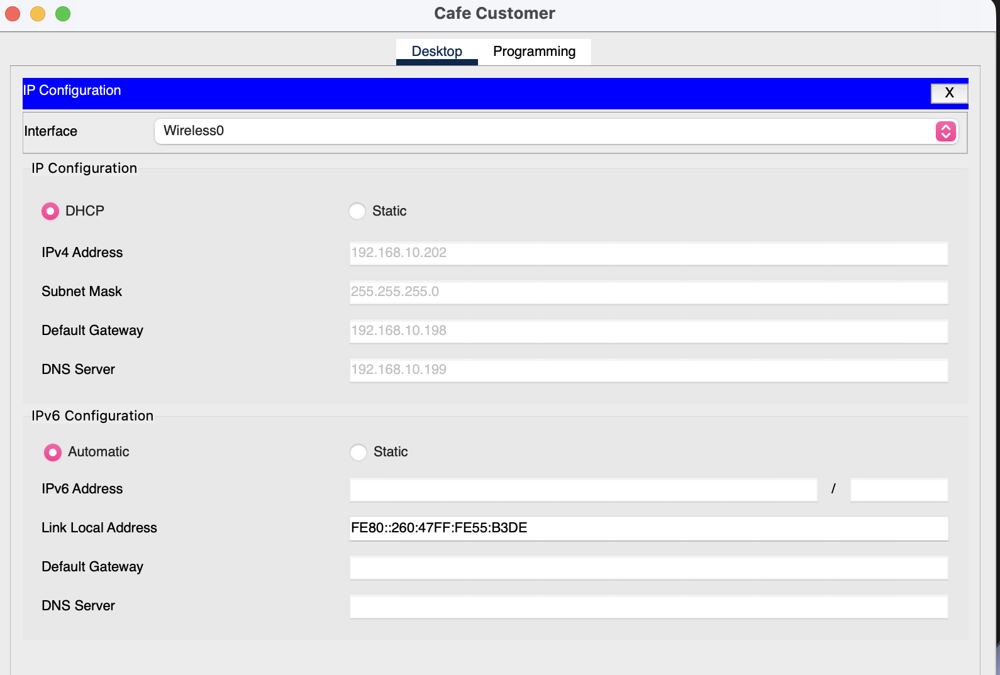

Cafe Customer independently confirmed DNS Server = `192.168.10.199`.

### Simulation limitation

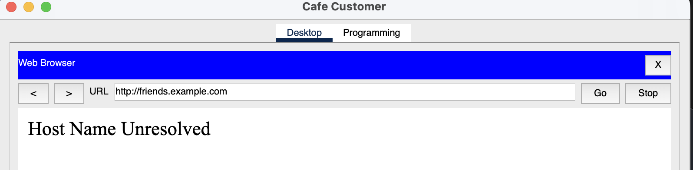

Despite the attack chain being fully configured and verified at every stage,
Packet Tracer returned "Host Name Unresolved" when the Cafe Customer browser
attempted to load `http://friends.example.com`. This is a known simulation
limitation in this version of the `.pka` file — the DNS resolution step does
not fully execute in the Packet Tracer engine even when the configuration is
correct.

**What was verified end-to-end:**
- Rogue AP broadcasting and accepting connections ✅
- Rogue DHCP distributing `192.168.10.199` as DNS server ✅
- Both victim devices received malicious DNS address ✅
- Hacker DNS service mapping `friends.example.com → 10.6.0.250` ✅
- Final DNS resolution step — not completed by Packet Tracer simulator ❌

The attack logic is architecturally sound and verified at each stage. The
limitation is in the simulation tool, not the attack understanding.

---

## Cross-Scenario Analysis

### Why none of these attacks required advanced skills

| Attack | Technical complexity | Primary vulnerability |
|--------|---------------------|----------------------|
| Guest network LAN access | Zero — just connect and ping | Router misconfiguration |
| Phishing → ransomware | Low — composing a convincing email | Human behaviour |
| Rogue AP + DNS hijack | Medium — requires DHCP/DNS setup | User trust in open WiFi |

The most sophisticated attack (Part 3) still required the victim to make one
avoidable decision: connecting to an open, unrecognised wireless network.

### The common thread — no alerts were generated

In all three scenarios, the attacks completed (or were fully configured)
without triggering any security alerts. There was no IDS, no email filtering,
no DNS protection, and no wireless intrusion detection. This is the realistic
state of many small office and home networks — and is exactly the gap that
Cyber Essentials is designed to close.

---

## What I Learned

1. **Default credentials are an open door.** The home router was accessed
   with `admin`/`admin` — the manufacturer default. Changing default
   credentials is one of the lowest-effort, highest-impact security controls
   available. Cyber Essentials explicitly requires this.

2. **Guest network isolation is a configuration choice, not automatic.**
   Most home routers offer guest networks, but the isolation settings are
   often misconfigured or misunderstood. "Guest network" does not automatically
   mean "isolated from LAN" — you have to configure it that way.

3. **Phishing succeeds because it targets people, not systems.** The
   ransomware in Part 2 required no exploit, no vulnerability, and no
   technical skill to deliver — just a convincing email and one click.
   Technical controls (email filtering, web proxies) help, but user awareness
   training is the only control that addresses the root cause.

4. **Open WiFi is a man-in-the-middle waiting to happen.** Connecting to
   an unrecognised open network hands control of your DNS — and therefore
   your entire browsing session — to whoever controls that network. A VPN
   is the correct mitigation, as demonstrated by the VPN Laptop in the
   topology which was unaffected.

5. **A verified attack chain is as valuable as a completed one.** The DNS
   hijack simulation limitation did not invalidate the lab — understanding
   *why* each stage of the attack works, and being able to verify it
   independently, demonstrates deeper knowledge than watching a simulation
   complete successfully.

## What I Would Do Differently

- In Part 1, attempt to access the router admin panel from Smartphone 3
  (external guest) to test whether the guest network also exposes the
  management interface — a separate but common misconfiguration.
- In Part 2, examine the mail server logs to see whether the phishing email
  left any trace that filtering could have caught.
- In Part 3, use the network sniffer in the hacker backpack to capture
  victim traffic and demonstrate what data would be visible to the attacker
  even before DNS hijacking takes effect.

---

## Files

| File | Description |
|------|-------------|
| `topology/Investigate_a_Threat_Landscape.pka` | Packet Tracer source file |
| `topology/topology.png` | Network diagram |
| `screenshots/01-successful-webcam-ping.png` | External smartphone reaching internal webcam |
| `screenshots/02-default-gateway.png` | Home Office PC ipconfig showing gateway |
| `screenshots/03-guest-network-settings.png` | Router guest network misconfiguration |
| `screenshots/04-phishing-email.png` | Composed phishing email from hacker |
| `screenshots/05-received-phishing-email.png` | Email received on victim device |
| `screenshots/06-ransomware.png` | Ransomware screen after visiting malicious URL |
| `screenshots/07-backpack-contents.png` | Hacker's equipment — sniffer and rogue AP |
| `screenshots/08-dhcp-service-hacker.png` | Rogue DHCP distributing malicious DNS |
| `screenshots/09-ipconfig-comparison.png` | VPN Laptop vs Cafe Customer DNS comparison |
| `screenshots/10-ip-config-cafe-customer.png` | Cafe Customer confirming malicious DNS |
| `screenshots/11-hostname-unresolved.png` | Packet Tracer simulation limitation |
